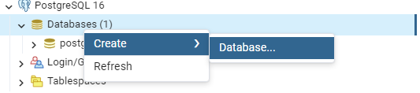
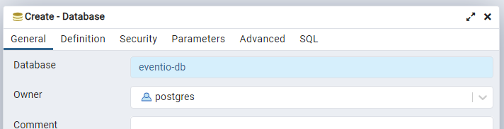
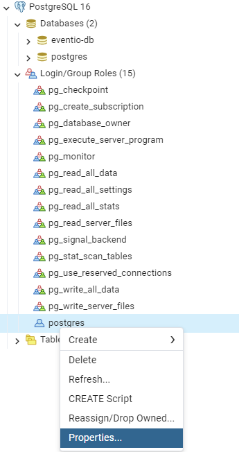
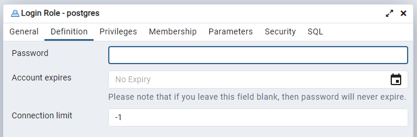

# Upute
## Preduvjeti
- Java 17
- Maven
## Postavljanje PostgreSQL baze
### Instalacija alata
- **PostgreSQL** - https://www.postgresql.org/download/
- **GUI** (pgAdmin ili neki drugi) - https://www.pgadmin.org/download/
- master password postaviti na `postgres` jer ce se ta lozinka koristiti za spajanje
### Izrada baze
- kroz **pgAdmin**, **DBeaver** ili **psql**
- napraviti novu bazu s imenom `eventio-db` i ownerom `postgres`
    
    
- po defaultu bi njegova lozinka trebala biti `postgres` ali za svaki slucaj postaviti je
    
    
### Pokretanje
- postgreSQL Server (pg_ctl.exe) bi se trebao upaliti na startupu racunala pa nije nužno pokretati pgAdmin da bi se backend spojio na bazu

## Pokretanje aplikacije
- mvn spring-boot:run ili zelena strelica u Eventio razredu

### Mapping
## /dogadaj
/filter - putem urla šalje:
 sort ("uzlazno" ili "silazno" - po vremenu, po interesu) 
        -> primjer: "vrijeme-uzlazno" ili "zainteresiranost-silazno" 
 lokacija (enum poštujte CAPSLOCK)
 vrijeme (24 sata, 7 dana, 30 dana)
 vrsta(enum poštujte CAPSLOCK)
 zavrseno (ne - prikazuje samo aktivne, da - prikazuje samo završene, kad ne pošaljete ništa oboje)
 placeno  (besplatno - prikaz bez placanja, placa se - prikaz s placanje, kad ne pošaljete ništa oboje)

/izrada/?id=INT       POST METODA  (id organizatora) SAMO ORGANIZATOR
{
  "nazivDogadaja": "Naziv događaja",
  "vrsta": "ENUM",
  "lokacija": "ENUM",
  "opisLokacije": "Opis lokacije",
  "vrijemePocetka": "2023-12-31T18:00:00",    //pripazite na format
  "cijenaUlaznice": "100.00",
  "opis": "Opis događaja",
  "galerija": "http://putanja-do-galerije.com"
}

/update/{id}
Body ko na /izradi
Ako je id na dogadaju i na trenutnom korisniku isti ili ako je korisnik admin
--> dogadaj updatean 

/organizator/{id}
Vraća listu pojedinacni responseDogadajDTO od pojedinog organizatora

/user/{id}
Vraća listu pojedinacni responseDogadajDTO na koje je reagiro pojedini user

/{id}
vraća responseDogadajDTO s idom ou putanje. 

Izgled responseDogadajDTO

npr.
{
    "organizator_id": 4,
    "username": "org",
    "dogadaj_id": 4,
    "nazivDogadaja": "Naziv događaja 4",
    "vrsta": "UMJETNOST",
    "lokacija": "SESVETE",
    "opisLokacije": "Opis lokacije",
    "vrijemePocetka": "2023-12-31T18:00:00",
    "cijenaUlaznice": "100.00",
    "opis": "Opis događaja",
    "galerija": "http://putanja-do-galerije.com",
    "recenzije": [],
    "zainteresiranosti": []
}

## /user
/all    - samo admin
vraća sve korisnike

/register
preko foruma kreira novog korisnika

/validate
endpoint koji vraća resposeKorisnikDTO. (id, username, email i ulogu)

/update/{id}
#### Mozes napisati ovdje body kak izgleda samo
{
    "id": 1,
    "username": "Franjo", 
    "email": "franjoRazarac@gmail.com", 
    "uloga": "POSJETITELJ"
}

## /organizator

/register
preko foruma kreira novog organizatora

/update/{id}
#### Mozes napisati ovdje body kak izgleda samo

{
    "username": "Franjo", 
    "email": "franjoRazarac@gmail.com", 
    "uloga": "ORGANIZATOR",
    "nazivOrganizacije": "Eventio",
    "adresa": "Eventovska 24",
    "poveznica": "http://putanja-do-eventovaca.com",
    "clanarina": true
}